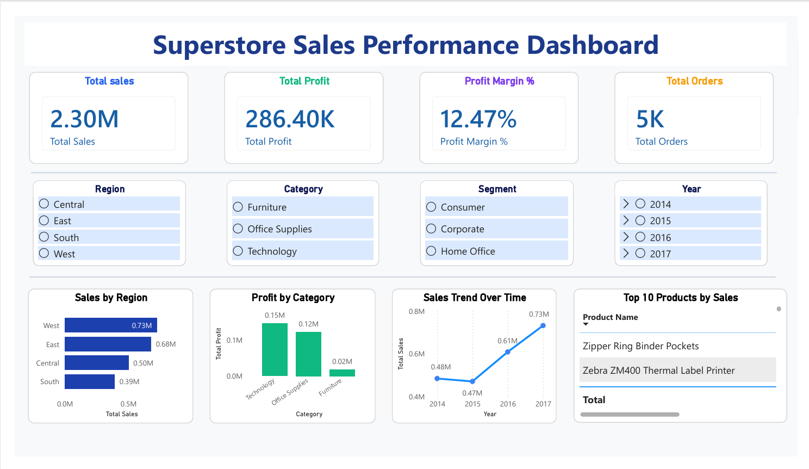

# 🏪 Superstore Sales Performance Dashboard
### End-to-End Data Analytics Project | Oracle ETL + Python + Power BI

[](https://powerbi.microsoft.com/)
[](https://www.oracle.com/)
[](https://www.python.org/)
[](https://www.oracle.com/)
[](https://www.atlassian.com/software/jira)
[](https://git-scm.com/)

---

> **An end-to-end analytics pipeline** — from raw CSV ingestion into Oracle Database through PL/SQL transformation and Python EDA, to an interactive Power BI dashboard delivering actionable retail insights.

---

## 📸 Dashboard Preview



---

## 📌 Table of Contents

- [Project Overview](#-project-overview)
- [Business Problem](#-business-problem)
- [Tech Stack](#-tech-stack)
- [Architecture](#-architecture)
- [Dashboard Features](#-dashboard-features)
- [Key Insights](#-key-insights)
- [Strategic Recommendations](#-strategic-recommendations)
- [Project Structure](#-project-structure)
- [How to Run](#-how-to-run)
- [Skills Demonstrated](#-skills-demonstrated)
- [Future Enhancements](#-future-enhancements)
- [Author](#-author)

---

## 📖 Project Overview

**Superstore Sales Analytics** is a complete **End-to-End Data Analytics Project** that analyzes the sales performance of a fictional retail company called **Superstore**.

The dataset contains detailed transaction records of orders placed between **2014 and 2017**, covering:
- Customer demographics and segments
- Product categories and sub-categories
- Shipping modes and regional data
- Key financial metrics: Sales, Quantity, Discount, and Profit

> 📦 **Dataset Source:** [Kaggle — Superstore Sales Dataset](https://www.kaggle.com/datasets/vivek468/superstore-dataset-final) (fictional retail data)

### Business Goal

Help management answer critical questions:
- Which regions and product categories are driving revenue and profit?
- Which products are consistently profitable or loss-making?
- How are different customer segments performing?
- What are the year-over-year sales trends?

This project demonstrates the **full data lifecycle** — from raw data ingestion to interactive business intelligence.

---

## 🏢 Business Problem

Retail companies generate massive amounts of sales data but often struggle to:

| Challenge | Impact |
|---|---|
| Identifying truly profitable regions and categories | Misallocated marketing budgets |
| Spotting underperforming products | Continued losses from poor SKUs |
| Understanding year-over-year trends | Missed seasonal planning opportunities |
| Making fast, data-driven decisions | Delayed responses to market changes |

This project addresses all four challenges through a modern, automated analytics pipeline.

---

## 🛠️ Tech Stack

| Component | Technology | Purpose |
|---|---|---|
| Database | Oracle Database 19c | Structured data storage |
| Data Ingestion | SQL\*Loader | High-speed bulk data loading |
| Data Transformation | PL/SQL (Packages & Procedures) | Cleaning, validation & business logic |
| Exploratory Analysis | Python (Pandas, Matplotlib, Seaborn) | EDA, statistical analysis & automation |
| Visualization | Power BI Desktop | Interactive BI dashboard |
| Project Management | JIRA + SDLC (Agile) | Sprint planning & task tracking |
| Version Control | Git & GitHub | Source code management |

---

## 🏗️ Architecture

```
Raw CSV Data
     │
     ▼
SQL*Loader ──────────► Oracle Database (Staging Tables)
                              │
                              ▼
                    PL/SQL Packages & Procedures
                    (Cleaning + Transformation)
                              │
                              ▼
                    Cleaned Oracle Tables
                              │
                              ▼
                    Python (Pandas + Seaborn)
                    (EDA + Validation)
                              │
                              ▼
                    Power BI Desktop
                    (Interactive Dashboard)
```

---

## 📊 Dashboard Features

| Feature | Description |
|---|---|
| KPI Cards | Total Sales, Profit, Margin %, and Orders at a glance |
| Regional Analysis | Sales breakdown across Central, East, South, West |
| Category Performance | Profit comparison across Furniture, Office Supplies, Technology |
| Sales Trend | Year-over-year line chart from 2014 to 2017 |
| Top 10 Products | Ranked table of best-performing products by sales |
| Interactive Slicers | Filter by Region, Category, Segment, and Year |

---

## 📈 Key Insights

- 💰 **Total Sales:** $2.30 Million across 4 years
- 📦 **Total Orders:** ~5,000 transactions
- 📊 **Overall Profit Margin:** 12.47%
- 🌍 **Highest Performing Region:** West ($0.73M in sales)
- 🖥️ **Top Performing Category:** Technology ($0.15M profit)
- 📉 **Lowest Profit Category:** Furniture ($0.02M profit — nearly break-even)
- 📈 **Strong growth trend:** Sales grew from $0.47M (2014) to $0.73M (2017)
- ⚠️ **Some products are consistently generating losses** despite high sales volumes

---

## 💡 Strategic Recommendations

1. **Double down on West Region & Technology** — highest ROI for marketing and inventory investment
2. **Review Furniture category** — slim margins suggest pricing or cost structure issues
3. **Identify and discontinue loss-making SKUs** — high sales volume doesn't always mean profitability
4. **Target Consumer & Corporate segments** — stronger revenue contributors than Home Office
5. **Leverage growth trend for seasonal planning** — use year-wise data for demand forecasting

---

## 📁 Project Structure

```bash
Superstore_Sales_Analytics/
│
├── data/
│   └── raw/                          # Original Superstore CSV dataset
│
├── sql/
│   └── loader/                       # SQL*Loader control files (.ctl)
│       ├── superstore_loader.ctl
│       └── load_data.sh
│
├── plsql/
│   ├── packages/                     # PL/SQL package specs & bodies
│   │   ├── pkg_superstore_etl.sql
│   │   └── pkg_superstore_reports.sql
│   └── procedures/                   # Standalone transformation procedures
│       ├── proc_clean_data.sql
│       └── proc_load_staging.sql
│
├── python/
│   ├── eda_analysis.py               # Exploratory data analysis
│   ├── visualizations.py             # Matplotlib & Seaborn charts
│   └── requirements.txt              # Python dependencies
│
├── powerbi/
│   ├── Superstore_Sales_Dashboard.pbix   # Power BI report file
│   └── screenshots/
│       └── dashboard.png             # Dashboard preview image
│
├── jira/
│   └── screenshots/                  # JIRA board & sprint screenshots
│
├── docs/
│   └── project_documentation.pdf     # Detailed project documentation
│
└── README.md
```

---

## 🚀 How to Run

### Prerequisites
- Oracle Database 19c (or compatible version)
- SQL\*Loader installed
- Python 3.8+
- Power BI Desktop (free)

### Step 1 — Clone the repository
```bash
git clone https://github.com/yourusername/Superstore_Sales_Analytics.git
cd Superstore_Sales_Analytics
```

### Step 2 — Set up Oracle Database
```sql
-- Create required tables
@sql/loader/create_tables.sql
```

### Step 3 — Load raw data using SQL*Loader
```bash
sqlldr userid=username/password control=sql/loader/superstore_loader.ctl
```

### Step 4 — Run PL/SQL transformations
```sql
-- Execute in Oracle SQL Developer or SQL*Plus
@plsql/packages/pkg_superstore_etl.sql
EXEC pkg_superstore_etl.run_transformation;
```

### Step 5 — Run Python EDA
```bash
pip install -r python/requirements.txt
python python/eda_analysis.py
```

### Step 6 — Open Power BI Dashboard
```
Open: powerbi/Superstore_Sales_Dashboard.pbix
Use the slicers to explore Region, Category, Segment, and Year
```

---

## 🧠 Skills Demonstrated

- ✅ End-to-end ETL pipeline design using Oracle tools
- ✅ Advanced PL/SQL package and procedure development
- ✅ Data cleaning, validation, and automation with Python
- ✅ Exploratory Data Analysis using Pandas, Matplotlib, Seaborn
- ✅ Interactive dashboard development with DAX measures in Power BI
- ✅ Agile project management using JIRA and SDLC methodology
- ✅ Version control and collaborative development with Git & GitHub

---

## 🔮 Future Enhancements

- [ ] **Customer Segmentation** using RFM (Recency, Frequency, Monetary) Analysis
- [ ] **Sales Forecasting** using Machine Learning (Prophet / ARIMA)
- [ ] **Real-time Dashboard** deployment via Power BI Service
- [ ] **NoSQL Integration** with MongoDB for unstructured data
- [ ] **Automated Report Generation** using Python (PDF exports)
- [ ] **Cloud Migration** to Oracle Cloud Infrastructure (OCI)

---


## 👩‍💻 Author

**Akilandeswari Rajendran**  
*Data Analyst | Oracle | Python | Power BI*

[](https://www.linkedin.com/in/aki24)
[](https://github.com/akiworkinfo-del)

---

> ⭐ If you found this project helpful, please consider giving it a star on GitHub!  
> Feel free to reach out for feedback or collaboration.
